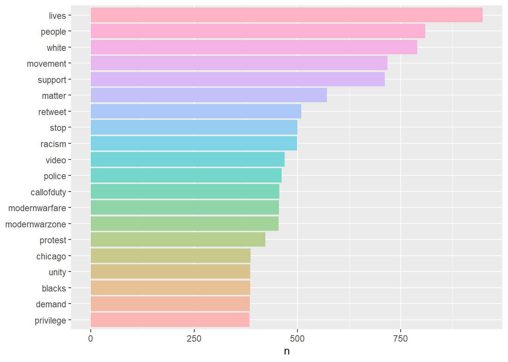

# Twitter Sentimental Analysis of BLM in R - NLP & Text Mining
**About :** 

This project aims to analyze sentiment trends on Twitter related to the Black Lives Matter Movement. Twitter sentiments following the tragic death of George Floyd, exploring the global Black Lives Matter (BLM) movement. Utilizing sentiment analysis, we scrutinize an extensive dataset of tweets to reveal intricate discussions on police brutality, racial justice, and BLM protests. Leveraging Twitter data, our study captures contemporaneous reactions, emotions, and viewpoints, offering a thorough comprehension of the socio-political panorama. 

The outcomes contribute to discussions on digital-age social activism, illuminating the influence of social media on public perceptions and the cultivation of dialogues regarding crucial societal matters.

Keywords: Twitter, Sentiment Analysis, Black Lives Matter, George Floyd, Social Activism.

**Overview: **

In this project, I conducted sentiment analysis using Twitter data related to the George Floyd incident. Leveraging R programming language and various packages such as tidytext, ggplot2, dplyr, and tm, I performed data preparation, cleaning, and tokenization to extract meaningful insights from the tweets. Additionally, I employed lexicons such as 'bing' and 'loughran' to analyze sentiment trends over time, visualizing the results using word clouds and bar charts. By demonstrating proficiency in data wrangling, sentiment analysis, and data visualization techniques, this project showcases my skills in R programming, text analysis, and data-driven storytelling.

**Data Analysis & Visualization:**
1. Visualize the Most Common Words
2. 

   

   
